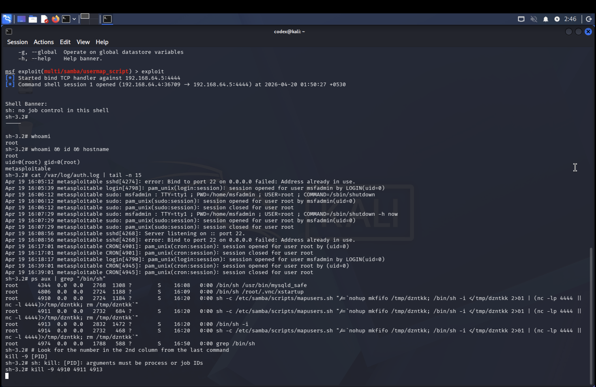
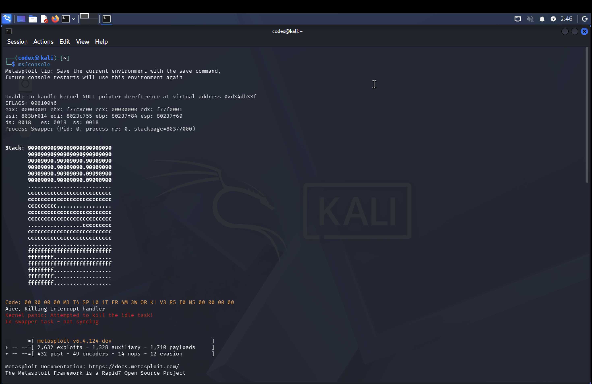

# Incident Investigation & Containment: CVE-2007-2447
**Document ID:** IR-LOG-11942
**Classification:** Technical / Internal Use

---

## 1. Forensic Evidence Archive
Technical artifacts documenting the full lifecycle of the incident: Initial exploitation, log-based detection, process identification, and final SIGKILL containment.

### Primary Forensic Log

### Environment Initialization

---
